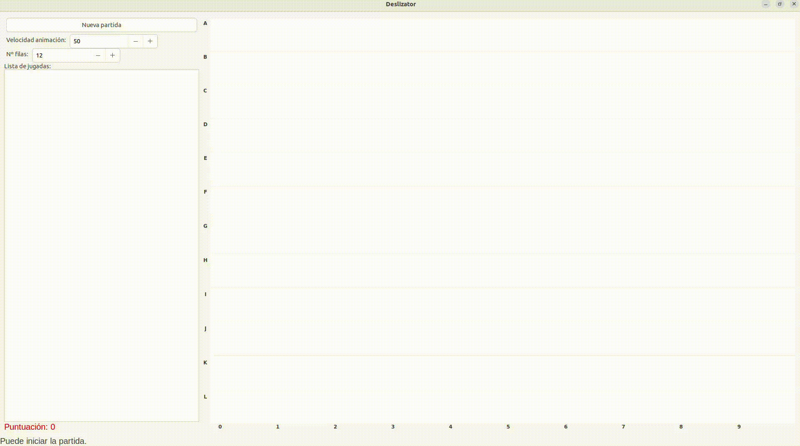

# Deslizator

Este repositorio corresponde a una práctica de la asignatura Paradigmas de Programación, perteneciente al Grado en Ingeniería Informática de la Universidad de Valladolid.
La práctica consiste en el desarrollo de un videojuego de caída de bloques, al estilo Tetris, implementado en Python con el uso de la librería wxPython.
Se incluye un vídeo a modo de ejemplo, donde se muestra una ejecución del juego.

## Reglas del juego

El juego consiste en que, en cada turno, se generan bloques en la primera fila del tablero. El jugador puede realizar una jugada de dos maneras: arrastrando un bloque con el ratón hasta que colisione con otro bloque o con una pared del tablero, o haciendo clic en una casilla vacía para que caiga la fila superior.

El objetivo es conseguir la mayor puntuación posible antes de que el tablero se llene y no se puedan añadir nuevas filas en la parte superior. Para obtener puntos, es necesario eliminar filas completas. Cada fila eliminada otorga 10 puntos. Si todos los bloques de la fila eliminada son del mismo color, se limpia todo el tablero y se obtiene una bonificación adicional: se suman tantos puntos como casillas ocupaban los bloques presentes en el tablero en ese momento.

## Ayuda en el juego

En la parte inferior derecha aparece un mensaje de ayuda que indica en que situación del juego se está.

## Otras opciones

El juego permite modificar el tamaño de las filas y la velocidad de la animación ajustando los valores correspondientes. Además, los bloques que caen en cada turno se basan en una secuencia predefinida, la cual está especificada en el archivo de texto lista_filas_a_caer.txt. Este archivo es editable y necesario para ejecutar el juego, al igual que contar con Python y la librería wxPython.

También puede observarse en el juego una lista de jugadas. Esta funcionalidad fue incluida como parte de la práctica de la asignatura y se basa en una lista de comandos de teclado. En las primeras versiones del juego, antes de implementar la interfaz gráfica, dichos comandos se utilizaban para ejecutar las jugadas. De hecho, el diseño del juego actual está basado en esa estructura de comandos.
